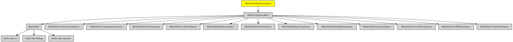

# MulleObjCInetFoundation

#### 📠 Internet-related classes like NSHost and NSURL for mulle-objc


The library adds **NSURL** and **NSHost** classes.

| Release Version                                       | Release Notes
|-------------------------------------------------------|--------------
|  [](//github.com//MulleObjCInetFoundation/actions)| [RELEASENOTES](RELEASENOTES.md) |


## Overview


| Requirement                                  | Description
|----------------------------------------------|-----------------------
| [MulleFoundationBase](https://github.com/MulleFoundation/MulleFoundationBase)             | 🛸 MulleFoundationBase does something
| [mulle-objc-list](https://github.com/mulle-objc/mulle-objc-list)             | 📒 Lists mulle-objc runtime information contained in executables.


## Add

Use [mulle-sde](//github.com/mulle-sde) to add MulleObjCInetFoundation to your project:

``` sh
mulle-sde add github:MulleWeb/MulleObjCInetFoundation
```

## Install

### Install with mulle-sde

Use [mulle-sde](//github.com/mulle-sde) to build and install MulleObjCInetFoundation and all dependencies:

``` sh
mulle-sde install --prefix /usr/local \
   https://github.com//MulleObjCInetFoundation/archive/latest.tar.gz
```

### Manual Installation

Install the requirements:

| Requirements                                 | Description
|----------------------------------------------|-----------------------
| [MulleFoundationBase](https://github.com/MulleFoundation/MulleFoundationBase)             | 🛸 MulleFoundationBase does something
| [mulle-objc-list](https://github.com/mulle-objc/mulle-objc-list)             | 📒 Lists mulle-objc runtime information contained in executables.

Download the latest [tar](https://github.com/MulleWeb/MulleObjCInetFoundation/archive/refs/tags/latest.tar.gz) or [zip](https://github.com/MulleWeb/MulleObjCInetFoundation/archive/refs/tags/latest.zip) archive and unpack it.

Install **MulleObjCInetFoundation** into `/usr/local` with [cmake](https://cmake.org):

``` sh
cmake -B build \
      -DCMAKE_INSTALL_PREFIX=/usr/local \
      -DCMAKE_PREFIX_PATH=/usr/local \
      -DCMAKE_BUILD_TYPE=Release &&
cmake --build build --config Release &&
cmake --install build --config Release
```

## Platforms and Compilers

All platforms and compilers supported by
[mulle-c11](//github.com/mulle-c/mulle-c11).


## Author

[Nat!](https://mulle-kybernetik.com/weblog) for Mulle kybernetiK

